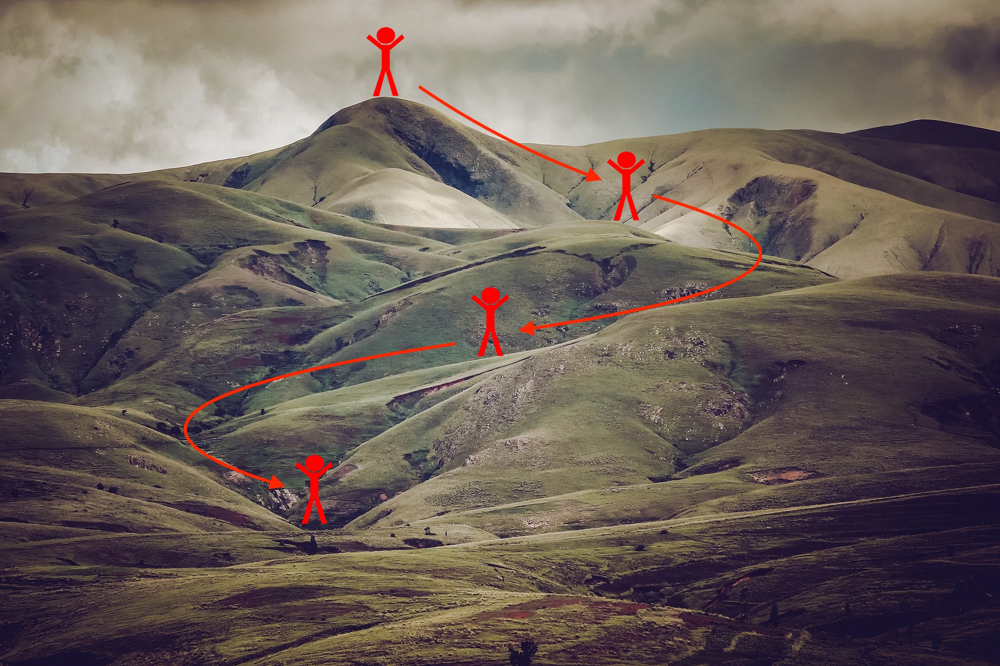

# Advanced-Optimization-Methods

Until now, we've always used Gradient Descent to update the parameters and minimize the cost. In this notebook, we will learn more advanced optimization methods that can speed up learning and perhaps even get you to a better final value for the cost function. Having a good optimization algorithm can be the difference between waiting days vs. just a few hours to get a good result. 

Gradient descent goes "downhill" on a cost function $J$. Think of it as trying to do this: 

<caption>
 <u> **Figure 1** </u>: **Minimizing the cost is like finding the lowest point in a hilly landscape**  At each step of the training, you update your parameters following a certain direction to try to get to the lowest possible point. 
</caption>

**Notations**: As usual, $\frac{\partial J}{\partial a } = $ `da` for any variable `a`.

To get started, run the following code to import the libraries you will need.
